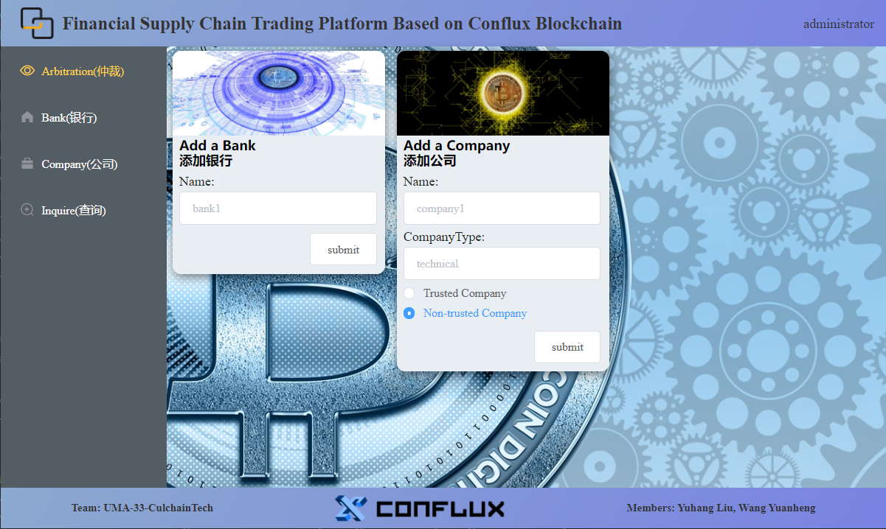

# trading-platform-based-on-conflux-blockchain（基于Conflux区块链与大数据的供应链金融服务生态解决方案）

## 简介
- 为了降低金融机构的贷款风险，利用供应链金融提高多层次供应商的融资能力，本项目应用区块链、供应链的信息结合和大数据技术，解决供应链上下游企业之间、供应链与银行间信息不对称问题，将物流、商流、资金流三者与“信息流”整合在一起，提高生产周期的效率和产业升级，促进金融监管和金融的良好发展环境。
- 在这个平台上，企业、银行和政府不仅可以基于conflux记录其公共信息和收据，还可以管理信用额度和资金流相关的一系列业务操作。通过区块链技术提供的身份认证、电子签章、智能合约、应收确权等功能，实现包括业务流程管理、客户管理、项目管理、预警管理、额度管理等功能的区块链+应收账款融资服务体系。

## 代码说明
- src为前端代码，主要使用了vue。
- src-block-chain为区块链智能合约代码。

## 效果展示

